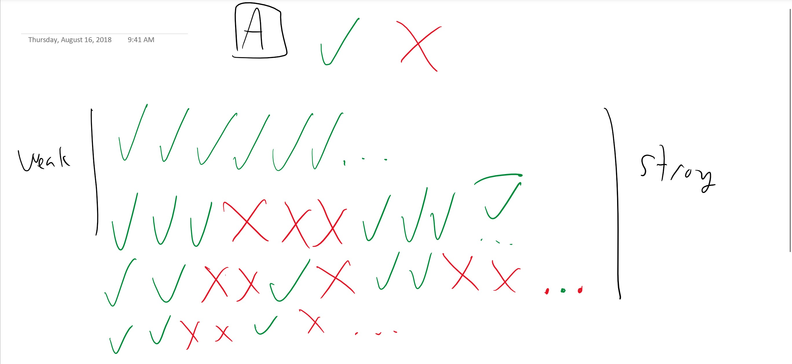

Fairness
########

Consider an action, ``A``, that is guarded by two states: on (represented by the green check mark) and off (represented by a red X). The :ref:`fairness` of the action determines how the spec is checked and can be either *weak*, *strong* or neither. Consider the following states:

If the action is not specified as weakly fair or strongly fair, then the process or action can be thought of as prone to permanent crashes, and it's possible that the action will not happen even if the guard is on. If the model "stutters", e.g. no processes can make progress, it is likely a symptom of requiring fairness. It is often desirable to have one fair process and one unfair process to ensure that deadlock or livelock doesn't occur even if a process crashes.

If marked weakly fair, the process is guaranteed to take an action if it can always happen, e.g. the guard is on. In the first two examples in the diagram above, the action will happen because in the first case, the guard is always on, and in the second case, even though it's off temporarily, it turns on again and always remains on. However in the case where on and off are alternating, or where it turns off and remains off, the action will not happen. Weakly fair processes ensure that the spec cannot stutter.

Strong fairness states that if the guard is never permanently disabled, it is guaranteed to happen. This means in the third case, where the guard is continually being toggled, the action will occur.

Strong fairness should be rarely used with specifications, and only with good reason. Weak fairness is generally what we are trying to model. 
